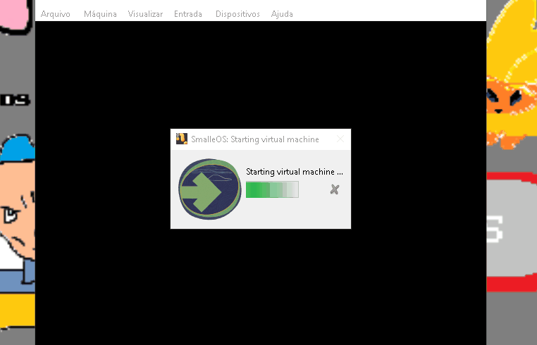

# SmalleOS            

## Overview

SmalleOS is a tiny **bootable terminal OS** (128 bytes) made by **DBS**.  
It runs in emulators like QEMU and can also be booted from a floppy image in VirtualBox.  

---

## Commands

Currently, only the following command works:

ver    (but it won't show the output.)

---

## Why this is tiny:
Because we want it tiny as possible as we can.
## And it doesn't show anything just to fit in the size...

so yea

All work done by DBS.
